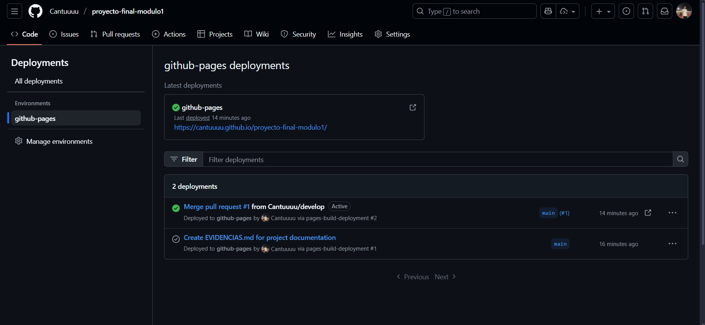
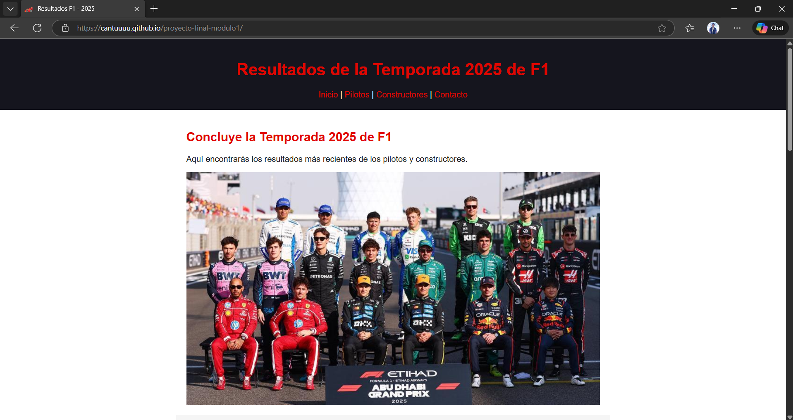
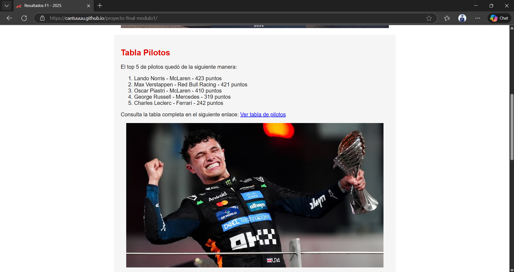

# Evidencias del Proyecto - Resultados F1 2025

## 1. Configuración de GitHub Pages

### Captura de Settings → Pages

**URL del sitio publicado:** `https://cantuuuu.github.io/proyecto-final-modulo1/`

---

## 2. Capturas del Sitio en Funcionamiento

### Vista Principal

### Vista de sección Pilotos

---

## 3. Aprendizajes

### ¿Qué fue lo más fácil y lo más retador?

**Lo más fácil:**  
Estructurar el contenido HTML básico con las etiquetas semánticas y aplicar estilos CSS simples para colores y tipografía.

**Lo más retador:**  
Lograr que las imágenes se centraran correctamente y mantuvieran un tamaño adecuado, especialmente al combinar reglas globales con clases específicas, esto ultimo lo exploré al querer aplicar un tamaño diferente a las imágenes de los pilotos.

---

### ¿Qué etiquetas semánticas usaste y por qué?

- **`<header>`**: Para el encabezado del sitio con título y navegación, identificando claramente la zona superior.
- **`<nav>`**: Para la barra de navegación interna, facilitando la accesibilidad.
- **`<main>`**: Para el contenido principal de la página de inicio.
- **`<section>`**: Para agrupar el contenido introductorio dentro de `<main>`.
- **`<footer>`**: Para el pie de página con información de copyright.
- **`<form>`**: Para el formulario de contacto, permitiendo la interacción del usuario.

Estas etiquetas mejoran la accesibilidad y la estructura, la idea es que sea fácil de entender, con una buena jerarquía y organización del contenido.

---

### ¿Cómo organizaste tus commits?

Organicé los commits de forma incremental siguiendo estas pautas:

1. **Commit inicial**: Estructura HTML básica con secciones principales.
2. **Commits de contenido**: Añadí textos, listas y enlaces por sección.
3. **Commits de estilos**: Implementé CSS para colores, tipografía y layout.
4. **Commits de corrección**: Ajustes en imágenes, centrado y responsive.
5. **Commit final**: Documentación y últimos detalles.

Cada commit tuvo un mensaje descriptivo y abarcó cambios relacionados, utilicé prefijos como "feat:", "docs:" para mayor claridad.

---

### ¿Qué mejorarías en la siguiente iteración?

1. **Diseño responsive más robusto**: Usar media queries para adaptar mejor el diseño a celulares o tablets.
2. **Estructura CSS modular**: Separar estilos en múltiples archivos (layout, componentes, variables).
3. **Guardado de formularios**: Implementar el envio de datos del formulario a un backend o servicio de correo.
4. **Optimización de imágenes**: Comprimir imágenes y usar formatos modernos como WebP, descubrí que muchas paginas usan este formato para mejorar tiempos de carga.
5. **Accesibilidad mejorada**: Añadir más atributos ARIA y mejorar el contraste de colores.
6. **Commits más granulares**: Dividir cambios grandes en commits más pequeños y específicos.

---
